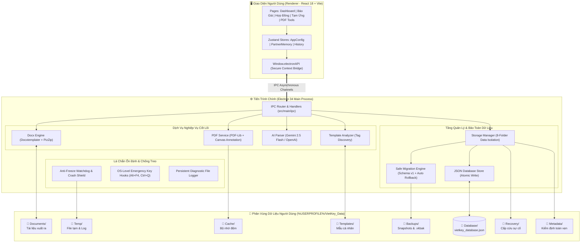

# ⚡ VietKey DocGen — Trợ Lý Tạo Tài Liệu Doanh Nghiệp Tự Động

<div align="center">


<p align="center">
  <b>Hệ thống phần mềm Desktop chuyên nghiệp tự động hóa soạn thảo tài liệu Doanh nghiệp siêu tốc từ Template Word (.docx) & PDF</b><br>
  Tích hợp bộ nhớ khách hàng thông minh, thuật toán tính toán báo giá tự động, bóc tách dữ liệu AI, ký số điện tử và lá chắn bảo toàn dữ liệu tuyệt đối.
</p>

[Tính Năng Chính](#-tính-năng-nổi-bật) •
[Kiến Trúc Dữ Liệu](#-kiến-trúc-bảo-toàn-dữ-liệu--di-trú-an-toàn) •
[Lá Chắn Chống Treo](#-lá-chắn-chống-treo--bảo-vệ-ổn-định-anti-freeze--crash-shield) •
[Dành Cho Người Dùng](#-hướng-dẫn-cài-đặt-cho-người-dùng-cuối-zero-config) •
[Dành Cho Lập Trình Viên](#-hướng-dẫn-dành-cho-lập-trình-viên-developer-guide)

</div>

---

## 📖 Giới Thiệu Tổng Quan

**VietKey DocGen** là giải pháp phần mềm Desktop dành riêng cho Công ty TNHH Đào Tạo Và Phát Triển Công Nghệ VietKey, giải quyết triệt để bài toán soạn thảo chứng từ, báo giá và hợp đồng vốn tiêu tốn nhiều thời gian và dễ xảy ra sai sót khi thao tác thủ công trên Microsoft Word / Excel.

### 🎯 Giá trị cốt lõi mang lại:
1. **Tốc độ vượt trội**: Tạo trọn bộ Báo giá, Hợp đồng, Giấy đề nghị tạm ứng trong **dưới 5 giây** thay vì 30 - 45 phút soạn thảo thủ công.
2. **Trải nghiệm đóng gói thương mại (Zero-Config)**: Người dùng cuối chỉ cần tải duy nhất **1 file installer (`VietKey DocGen Setup 1.0.0.exe`)**, bấm đúp để cài đặt tự động mà không cần cài thêm Node.js, npm, Python hay bất kỳ công cụ phát triển nào.
3. **Bảo toàn dữ liệu vĩnh cửu**: Dữ liệu khách hàng, lịch sử và các mẫu tài liệu cá nhân được lưu trữ biệt lập tại phân vùng riêng `%USERPROFILE%\VietKey_Data`, không bao giờ bị mất hoặc bị ghi đè khi cập nhật phần mềm hoặc gỡ cài đặt.
4. **Độ ổn định tối đa**: Trang bị lá chắn chống treo ứng dụng (Anti-Freeze Guard), bắt phím tắt cấp hệ điều hành (<kbd>Alt</kbd> + <kbd>F4</kbd>, <kbd>Ctrl</kbd> + <kbd>Q</kbd>) và tự động phục hồi lỗi đồ họa.

---

## 🌟 Tính Năng Nổi Bật

### 1. 📋 Bảng Báo Giá Thông Minh & Tiện Ích Tốc Độ Cao (`QuotationForm`)
- **Tự Động Tính Tỷ Lệ Tăng Giá (%)**:
  - Nhập đơn giá gốc và phần trăm `%` muốn tăng (ví dụ: giá gốc `1.340`, tăng `20%` $\rightarrow$ hệ thống tự động làm tròn và tính ra **`1.608`** VNĐ).
  - Tăng `%` đồng loạt cho hàng chục mặt hàng cùng lúc chỉ với 1 cú click hoặc các phím tắt nhanh: `+5%`, `+10%`, `+15%`, `+20%`, `+25%`.
- **Cột Ghi Chú Tùy Chọn Linh Hoạt**:
  - Cho phép bật/tắt nút `[+ Cột Ghi Chú]` ngay trên bảng hàng hóa (mặc định ẩn để tinh gọn tối đa).
  - Khi bật: hiển thị cột Ghi chú và tự động chọn mẫu Word 5 cột chuẩn chỉnh (`STT` | `TÊN HÀNG HÓA` | `GHI CHÚ` | `ĐƠN VỊ` | `ĐƠN GIÁ`).
- **Trợ Lý AI Bóc Tách Tin Nhắn Báo Giá**:
  - Dán đoạn tin nhắn trao đổi thô từ Zalo/Viber/Email, mô hình AI (Google Gemini 2.5 Flash / OpenAI GPT) sẽ tự động bóc tách chính xác Tên vật tư, Đơn vị tính, Số lượng, Đơn giá và điền trực tiếp vào bảng.
- **Xuất Đồng Thời Word & PDF**: Tùy chọn xuất riêng file `.docx`, xuất `.pdf` hoặc xuất cả 2 file cùng lúc vào thư mục lưu trữ được chỉ định.

### 2. 📝 Hợp Đồng Nguyên Tắc Mua Bán (`ContractForm`)
- **Soạn Thảo Chuẩn Pháp Lý**: Mẫu hợp đồng nguyên tắc chuẩn mực giữa VietKey và đối tác/khách hàng.
- **Bộ Nhớ Đối Tác Thông Minh (Partner Memory Hub)**:
  - Tự động ghi nhớ toàn bộ thông tin đối tác sau mỗi lần lập tài liệu: Tên công ty, Mã số thuế, Người đại diện, Chức vụ, Địa chỉ kinh doanh, Số tài khoản, Ngân hàng.
  - Tìm kiếm mờ (Fuzzy Search): Chỉ cần gõ vài ký tự trong tên công ty hoặc mã số thuế, hệ thống tự động điền toàn bộ trường dữ liệu còn lại.
- **Chuẩn Hóa Thể Thức Hành Chính**:
  - Tự động nhận diện và chuẩn hóa danh xưng (Ông/Bà), viết hoa chuẩn tên riêng và doanh nghiệp.

### 3. 💳 Giấy Đề Nghị Tạm Ứng (`AdvanceRequestForm`)
- Quản lý các đợt tạm ứng tiến độ (Đợt 1, Đợt 2...), lý do tạm ứng vật tư/nhân công công trình nhanh gọn.
- **Bộ Máy Đọc Số Tiền Thành Chữ Độc Quyền**:
  - Chuyển đổi chính xác 100% mọi giá trị tiền tệ từ hàng triệu đến hàng trăm tỷ đồng sang chữ tiếng Việt chuẩn ngữ pháp (ví dụ: `1.250.000.000` $\rightarrow$ *"Một tỷ hai trăm năm mươi triệu đồng chẵn"*).

### 4. 🖨️ Bộ Công Cụ PDF Chuyên Nghiệp (`PdfTools`)
- **Trình Xem PDF Tích Hợp**: Xem trước tài liệu PDF sắc nét trực tiếp trong ứng dụng mà không cần cài Adobe Reader.
- **Ký Số & Chèn Dấu Điện Tử**:
  - Ký trực tiếp trên bảng vẽ cảm ứng (Signature Canvas) với nét mực mượt mà.
  - Tải lên ảnh con dấu đỏ / chữ ký định dạng PNG trong suốt.
  - Tự do kéo thả, thay đổi kích thước và căn chỉnh vị trí chữ ký / con dấu trên bất kỳ trang nào của file PDF.
- **Chú Thích & Đóng Dấu Tài Liệu**:
  - Highlight bôi màu văn bản quan trọng.
  - Đóng dấu chứng thực: *ĐÃ DUYỆT*, *APPROVED*, *CONFIDENTIAL*, *BẢN NHÁP*...
- **Gộp & Trích Xuất Trang PDF**: Ghép nhiều file PDF thành một tệp duy nhất hoặc trích xuất các trang cần thiết.

### 5. 🧩 Trình Quản Lý Mẫu & Biểu Mẫu Động (`TemplateManager` & `DynamicForm`)
- **Phân Tích Cú Pháp Template Tự Động**: Nạp bất kỳ file `.docx` nào có chứa các thẻ biến dạng `{ten_bien}`, hệ thống tự động phân tích và sinh ra giao diện nhập liệu trực quan tương ứng.
- **Phân Tách Mẫu Rõ Ràng**:
  - *Mẫu hệ thống (System Templates)*: Đóng gói sẵn trong ứng dụng, luôn sẵn sàng sử dụng.
  - *Mẫu cá nhân (User Templates)*: Người dùng tự thêm vào theo nhu cầu doanh nghiệp, được bảo vệ vĩnh viễn trong phân vùng `VietKey_Data/Templates`.

### 6. 📊 Lịch Sử & Thống Kê (`History` & `Dashboard`)
- **Bảng Thống Kê Trực Quan**: Theo dõi số lượng tài liệu đã sinh theo ngày, tuần, tháng và tỷ lệ các loại chứng từ.
- **Tra Cứu Nhanh Lịch Sử**: Tìm kiếm tài liệu cũ theo tên đối tác, loại tài liệu hoặc thời gian; mở trực tiếp file hoặc mở nhanh thư mục chứa trên Windows Explorer.

---

## 🏛️ Sơ Đồ Kiến Trúc Hệ Thống



---

## 🔒 Kiến Trúc Bảo Toàn Dữ Liệu & Di Trú An Toàn

Để đảm bảo dữ liệu doanh nghiệp không bao giờ bị mất mát khi cập nhật phần mềm, gỡ bỏ hoặc cài đặt lại phiên bản mới, **VietKey DocGen** áp dụng kiến trúc cô lập dữ liệu 8 thư mục tại đường dẫn cố định của người dùng:

> **Đường dẫn mặc định**: `C:\Users\<Tên_Người_Dùng>\VietKey_Data\` (tương đương `%USERPROFILE%\VietKey_Data\`)

### 📁 Bảng Phân Tách 8 Phân Vùng Chuyên Biệt

| Thư Mục | Tên File / Dữ Liệu Chứa | Mục Đích Sử Dụng | Chính Sách Bảo Toàn |
| :--- | :--- | :--- | :--- |
| `Database/` | `vietkey_database.json` | Lưu trữ toàn bộ danh bạ khách hàng, cấu hình công ty, lịch sử xuất tài liệu. | **Bảo tồn vĩnh viễn**. Không bao giờ bị ghi đè khi nâng cấp phần mềm. |
| `Documents/` | `*.docx`, `*.pdf` | Thư mục lưu trữ mặc định các tài liệu được phần mềm xuất ra. | Người dùng toàn quyền quản lý, ứng dụng không tự ý xóa. |
| `Templates/` | `*.docx` | Chứa các mẫu Word cá nhân do người dùng tự thiết kế và tải lên. | **Bảo tồn vĩnh viễn**. Hoàn toàn tách biệt khỏi các mẫu gốc của hệ thống. |
| `Backups/` | `*.vkbak`, `*.json` | Lưu snapshot tự động trước mỗi lần di trú schema và các bản sao lưu thủ công. | Lưu trữ nhiều phiên bản, cho phép khôi phục bất cứ lúc nào. |
| `Cache/` | Thumbnail, PDF render cache | Lưu cache xem trước ảnh và trang PDF nhằm tăng tốc độ tải. | Cho phép dọn dẹp giải phóng ổ đĩa an toàn qua màn hình Cài đặt. |
| `Temp/` | `main-process.log`, file tạm | Chứa nhật ký chạy ứng dụng và file tạm sinh ra trong lúc chuyển đổi Word/PDF. | Tự động dọn dẹp định kỳ hoặc dọn thủ công qua Cài đặt. |
| `Recovery/` | Emergency dumps | Lưu trạng thái cấp cứu khi hệ điều hành đột ngột mất điện hoặc tắt máy đột ngột. | Hỗ trợ phục hồi tự động khi ứng dụng khởi động lại. |
| `Metadata/` | Health stats, audit manifest | Lưu trạng thái kiểm định tính toàn vẹn và phiên bản cấu trúc dữ liệu. | Hệ thống sử dụng để tự kiểm tra lỗi (Self-Healing). |

### 🛡️ Cơ Chế Di Trú Dữ Liệu An Toàn (Safe Migration Engine)
- **Kiểm soát phiên bản lược đồ (Schema Versioning)**: Hiện tại hệ thống đang vận hành phiên bản **`CURRENT_SCHEMA_VERSION = 1`**.
- **Tự động Snapshot trước khi Migration**: Trước khi thực hiện bất kỳ thay đổi nào lên cấu trúc CSDL, hệ thống luôn tự động nhân bản một file snapshot nguyên vẹn vào `VietKey_Data/Backups/vietkey_database_pre_v{old}.json`.
- **Tự Động Rollback Khi Thất Bại**: Nếu quá trình di trú gặp sự cố, hệ thống sẽ tự động hoàn tác (rollback) về bản snapshot trước đó và thông báo rõ ràng cho người dùng, đảm bảo dữ liệu không bị hỏng dở dang.
- **Sao Lưu & Phục Hồi 1-Click (`.vkbak`)**: Trong trang **Cài Đặt**, người dùng có thể:
  - Bấm **"Sao lưu dữ liệu ngay"** để đóng gói toàn bộ CSDL và Mẫu người dùng thành một file nén `.vkbak`.
  - Bấm **"Khôi phục dữ liệu"** từ file `.vkbak` (hệ thống sẽ tự động tạo một snapshot an toàn ngay trước khi nạp dữ liệu mới).
  - Bấm **"Xuất dữ liệu"** để sao chép ra USB hoặc ổ cứng ngoài.

---

## 🛡️ Lá Chắn Chống Treo & Bảo Vệ Ổn Định (Anti-Freeze & Crash Shield)

Do ứng dụng sử dụng thiết kế giao diện hiện đại không viền (Frameless Window) để tối ưu không gian làm việc, hệ thống được trang bị các cơ chế phòng vệ nhiều lớp:

1. **Phím Tắt Khẩn Cấp Cấp Hệ Điều Hành (OS-Level Emergency Kill Switches)**:
   - Hệ thống chặn trực tiếp sự kiện bàn phím từ `webContents.on('before-input-event')`:
     - <kbd>Alt</kbd> + <kbd>F4</kbd> hoặc <kbd>Ctrl</kbd> + <kbd>Q</kbd>: **Buộc đóng ứng dụng lập tức** mà không cần thông qua giao diện Web. Ngay cả khi giao diện React đang bị treo cứng, người dùng vẫn luôn tắt được ứng dụng một cách an toàn.
     - <kbd>F5</kbd> hoặc <kbd>Ctrl</kbd> + <kbd>Shift</kbd> + <kbd>R</kbd>: **Tải lại giao diện khẩn cấp** để khôi phục trạng thái ban đầu khi giao diện đồ họa bị gián đoạn.
2. **Bộ Giám Sát Tiến Trình Đơ (Unresponsive Watchdog)**:
   - Tự động bắt sự kiện `mainWindow.on('unresponsive')`. Nếu sau một khoảng thời gian giao diện không phản hồi, một hộp thoại hệ thống sẽ xuất hiện cho phép người dùng lựa chọn: *"Chờ ứng dụng phản hồi"* hoặc *"Buộc tắt ứng dụng ngay"*.
3. **Phòng Ngừa Lỗi Trình Điều Khiển Đồ Họa (GPU Crash Prevention)**:
   - Đã loại bỏ hoàn toàn các cờ lệnh ép xung GPU rủi ro (như `--ignore-gpu-blocklist` hoặc `--enable-gpu-rasterization` nguy cơ gây lỗi Windows Watchdog LiveKernelEvent). Hệ thống tự động cân bằng phần cứng an toàn.
4. **Nhật Ký Chẩn Đoán Lỗi Cục Bộ (Execution File Logger)**:
   - Toàn bộ lỗi `uncaughtException` hay `unhandledRejection` đều được tự động ghi lại tại `VietKey_Data/Temp/main-process.log` kèm hộp thoại báo lỗi chi tiết, không bao giờ để xảy ra tình trạng ứng dụng "chết âm thầm" không rõ nguyên nhân.

---

## 🚀 Hướng Dẫn Cài Đặt Cho Người Dùng Cuối (Zero-Config)

Ứng dụng được đóng gói thành **MỘT FILE CÀI ĐẶT DUY NHẤT**. Người dùng cuối **KHÔNG CẦN** cài đặt Node.js, npm, Python hay chạy bất kỳ câu lệnh nào.

### 📥 3 Bước Cài Đặt Đơn Giản:
1. **Tải File Cài Đặt**: Nhận file `VietKey DocGen Setup 1.0.0.exe` từ quản trị viên hoặc thư mục phát hành.
2. **Chạy File**: Nhấp đúp chuột vào file `VietKey DocGen Setup 1.0.0.exe`.
   - Trình cài đặt NSIS sẽ tự động giải nén toàn bộ tài nguyên, tạo shortcut ngoài màn hình Desktop và trong menu Start.
3. **Sử Dụng Ngay**: Sau khi cài đặt hoàn tất, phần mềm sẽ tự động mở lên và sẵn sàng phục vụ công việc.

> [!TIP]
> **Khi cài đặt phiên bản mới hơn trong tương lai**: Người dùng chỉ cần chạy file cài đặt mới. Toàn bộ dữ liệu khách hàng, cấu hình và lịch sử trong `VietKey_Data` sẽ được nhận diện và bảo toàn tự động 100%.

---

## 💻 Hướng Dẫn Dành Cho Lập Trình Viên (Developer Guide)

### 1. Yêu Cầu Môi Trường
- **Hệ điều hành**: Windows 10 / Windows 11 (64-bit)
- **Node.js**: Phiên bản 18.x trở lên (khuyến nghị 20.x LTS)
- **Trình quản lý gói**: npm 9.x trở lên
- **Phần mềm Office**: Microsoft Word hoặc WPS Office (để kiểm tra hiển thị file `.docx` đã xuất)

### 2. Cài Đặt Mã Nguồn & Thư Viện
Mở terminal PowerShell tại thư mục dự án và thực hiện:
```powershell
# Cài đặt toàn bộ dependencies (bao gồm electron-builder app-deps)
npm install
```

### 3. Chạy Chế Độ Phát Triển (Development Mode)
```powershell
npm run dev
```
- Lệnh này sẽ tự động dọn dẹp các tiến trình Electron cũ còn sót (`taskkill`), khởi động Vite Dev Server cho React và mở cửa sổ Electron với chế độ Hot Reload.

### 4. Kiểm Tra Mã Nguồn & Chạy Unit Tests
```powershell
# 1. Kiểm tra tĩnh kiểu dữ liệu TypeScript (0 errors)
npm run typecheck

# 2. Chạy toàn bộ bộ kiểm thử tự động (Vitest)
npm run test
```

### 5. Đóng Gói Bộ Cài Đặt Standalone (.exe)
Để tạo ra file cài đặt thương mại độc lập `dist/VietKey DocGen Setup 1.0.0.exe`:
```powershell
npm run build:win
```
- Quá trình này sẽ:
  1. Biên dịch TypeScript và build bundle tối ưu với `electron-vite build`.
  2. Tự động gom các template Word từ thư mục `templates/` vào `extraResources`.
  3. Sử dụng `electron-builder` để đóng gói thành duy nhất một trình cài đặt NSIS 64-bit nằm trong thư mục `dist/`.

### 📋 Danh Sách Lệnh Scripts Hữu Ích

| Câu Lệnh | Chức Năng |
| :--- | :--- |
| `npm run dev` | Khởi chạy môi trường phát triển với Hot Module Replacement (HMR). |
| `npm run build` | Biên dịch mã nguồn React, Main và Preload vào thư mục `out/`. |
| `npm run build:win` | **(Chính)** Đóng gói file cài đặt Windows Installer duy nhất (`.exe`). |
| `npm run build:portable` | Đóng gói phiên bản Portable chạy ngay không cần cài đặt. |
| `npm run build:dir` | Đóng gói ra thư mục unpacked (`dist/win-unpacked`) để kiểm tra nhanh file thực thi. |
| `npm run typecheck` | Kiểm tra lỗi kiểu dữ liệu TypeScript toàn dự án (`tsc --noEmit`). |
| `npm run test` | Chạy bộ kiểm thử tự động với Vitest (7 test suites, 32+ tests). |
| `npm run benchmark` | Chạy benchmark kiểm tra hiệu năng bóc tách PDF và tài liệu. |

---

## 📂 Cấu Trúc Thư Mục Dự Án

```text
tool-dung-nhanh/
├── .agents/                      # Cấu hình AI Assistant & bộ quy tắc bảo mật
├── build/                        # Tài nguyên đóng gói (Icon ứng dụng: icon.ico, icon.png)
├── dist/                         # Thư mục chứa sản phẩm sau khi build (File .exe Setup)
├── out/                          # Mã nguồn sau khi biên dịch bởi electron-vite
├── resources/                    # Tài nguyên tĩnh bổ trợ
├── scripts/                      # Scripts kiểm thử mẫu Word & benchmark hệ thống
├── src/                          # TOÀN BỘ MÃ NGUỒN CHÍNH
│   ├── main/                     # Tiến trình chính Electron (Node.js Environment)
│   │   ├── index.ts              # Entry point, Window Lifecycle, Anti-Freeze Watchdog
│   │   ├── ipc/                  # Định nghĩa và đăng ký các kênh IPC Handlers
│   │   └── services/             # Các dịch vụ cốt lõi:
│   │       ├── ai-parser.ts         # Tích hợp AI bóc tách báo giá (Gemini, OpenAI)
│   │       ├── database.ts          # Quản lý CSDL JSON (vietkey_database.json)
│   │       ├── docx-engine.ts       # Đọc ghi và render template Word (Docxtemplater)
│   │       ├── migration.ts         # Bộ máy di trú cấu trúc dữ liệu và snapshot
│   │       ├── pdf-converter.ts     # Bộ máy chuyển đổi Docx sang PDF
│   │       ├── pdf-service.ts       # Ký số điện tử, đóng dấu, vẽ canvas trên PDF
│   │       ├── storage-manager.ts   # Quản lý 8 phân vùng dữ liệu VietKey_Data
│   │       └── template-analyzer.ts # Tự động phân tích thẻ biến {variable}
│   ├── preload/                  # Cầu nối bảo mật an toàn (Context Bridge)
│   │   ├── index.ts              # Phơi bày electronAPI an toàn cho giao diện UI
│   │   └── index.d.ts            # Định nghĩa kiểu dữ liệu TypeScript cho window.electronAPI
│   ├── renderer/                 # Giao diện người dùng (React 18 + TailwindCSS v4)
│   │   └── src/
│   │       ├── assets/           # CSS toàn cục, Design Tokens, bảng màu Onyx & Cyan
│   │       ├── components/       # Header, Sidebar, TitleBar, Floating Actions
│   │       ├── pages/            # Các trang chức năng chính:
│   │       │   ├── Dashboard.tsx            # Bảng điều khiển tổng quan
│   │       │   ├── QuotationForm.tsx        # Soạn bảng báo giá thông minh
│   │       │   ├── ContractForm.tsx         # Hợp đồng nguyên tắc mua bán
│   │       │   ├── AdvanceRequestForm.tsx   # Giấy đề nghị tạm ứng tiến độ
│   │       │   ├── PdfTools.tsx             # Bộ công cụ PDF & Ký số điện tử
│   │       │   ├── DynamicForm.tsx          # Biểu mẫu tự động sinh theo mẫu Word
│   │       │   ├── TemplateManager.tsx      # Quản lý danh sách mẫu tài liệu
│   │       │   ├── History.tsx              # Tra cứu lịch sử xuất tài liệu
│   │       │   └── Settings.tsx             # Quản trị dữ liệu, Backup & Sức khỏe hệ thống
│   │       └── stores/           # Quản lý trạng thái ứng dụng với Zustand
│   └── shared/                   # Định nghĩa Interface & Types dùng chung giữa Main và Renderer
├── templates/                    # Thư mục chứa các mẫu Word chuẩn của VietKey
│   ├── BaoGia.docx               # Mẫu Báo giá chuẩn 4 cột
│   ├── BaoGia_CoGhiChu.docx      # Mẫu Báo giá chuẩn 5 cột (có cột Ghi chú)
│   └── HopDongNguyenTac.docx     # Mẫu Hợp đồng nguyên tắc mua bán chuẩn mực
├── AGENTS.md                     # Quy tắc bắt buộc về bảo mật Git và mã hóa UTF-8
├── electron.vite.config.ts       # Cấu hình Electron-Vite đa tiến trình
├── package.json                  # Cấu hình gói thư viện và metadata electron-builder
└── README.md                     # Tài liệu kỹ thuật và hướng dẫn sử dụng chi tiết
```

---

## ⌨️ Bảng Phím Tắt Tiện Ích (Keyboard Shortcuts)

| Phím Tắt | Ngữ Cảnh Hoạt Động | Chức Năng |
| :--- | :--- | :--- |
| <kbd>Ctrl</kbd> + <kbd>Enter</kbd> | Form Báo Giá / Hợp Đồng / Tạm Ứng | **Xuất nhanh tài liệu** (Word / PDF) theo cấu hình hiện tại |
| <kbd>Ctrl</kbd> + <kbd>K</kbd> | Toàn ứng dụng | Mở thanh tìm kiếm nhanh & Command Palette |
| <kbd>Tab</kbd> / <kbd>Shift</kbd> + <kbd>Tab</kbd> | Bảng hàng hóa báo giá | Chuyển tiếp nhanh giữa các ô nhập liệu (Tên hàng $\rightarrow$ ĐVT $\rightarrow$ Đơn giá) |
| <kbd>Alt</kbd> + <kbd>F4</kbd> | Toàn ứng dụng (OS-Level) | **Đóng ứng dụng khẩn cấp** lập tức (kể cả khi giao diện bị đơ) |
| <kbd>Ctrl</kbd> + <kbd>Q</kbd> | Toàn ứng dụng (OS-Level) | **Thoát ứng dụng** an toàn và giải phóng tài nguyên |
| <kbd>F5</kbd> | Toàn ứng dụng (OS-Level) | **Tải lại giao diện** khẩn cấp (Emergency Reload) |
| <kbd>Ctrl</kbd> + <kbd>Shift</kbd> + <kbd>R</kbd> | Toàn ứng dụng (OS-Level) | Buộc tải lại giao diện không dùng cache |

---

## 🔒 Quy Tắc An Toàn & Bảo Mật Dữ Liệu (Security & Compliance)

Dự án áp dụng nghiêm ngặt các quy tắc an toàn đã được định nghĩa trong [AGENTS.md](file:///d:/cong%20ty%20vietkey/D%E1%BB%B0%20%C3%81N%202026/tool%20d%C3%B9ng%20nhanh/AGENTS.md):

1. **Tuyệt Đối Không Tự Ý Đẩy Lên Git (`git push`)**:
   - Mọi thao tác đẩy mã nguồn lên GitHub / GitLab bắt buộc phải có sự xác nhận trực tiếp từ người quản trị dự án.
2. **Bảo Vệ Dữ Liệu Nhạy Cảm**:
   - Không commit các file chứa API Key, file biến môi trường (`.env`, `.env.local`), database cục bộ hoặc các file tạm thời của Microsoft Office (`~$*.doc*`, `*.tmp`).
3. **Bảo Vệ Mã Hóa Tiếng Việt (Strict UTF-8 Protection)**:
   - Toàn bộ mã nguồn, tài liệu hướng dẫn, file cấu hình JSON và cơ sở dữ liệu đều được lưu dưới định dạng chuẩn **UTF-8**.
   - Tuyệt đối không để xảy ra hiện tượng lỗi hiển thị dấu tiếng Việt (mojibake).

---

<div align="center">
  <sub>Bản quyền phần mềm thuộc về <b>Công ty TNHH Đào Tạo Và Phát Triển Công Nghệ VietKey</b> © 2026</sub><br>
  <sub>Phát triển với sự đồng hành của Antigravity AI Assistant</sub>
</div>
